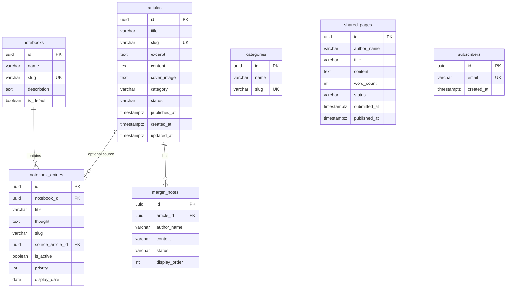

# 08 — Domain and Data Model

**Source of truth:** `src/lib/db/schema.sql`  
**Type mirror:** `src/types/index.ts`  
**No production DB writes performed.** Live connectivity proven only via `GET /api/health` (`database: "ok"`). **VERIFIED**

## Plain-language domain model

TWN stores **articles** (editorial notes) with a string **category** and publication **status**. A default **notebook** holds **notebook entries** (short thoughts) that can optionally link to an article and optionally be scheduled by **display_date** for Today's Page. Visitors submit **shared pages** (moderated reflections) and **margin notes** (≤120 chars on an article). **Subscribers** store newsletter emails. A **categories** table is seeded but not wired to articles (articles use CHECK constraints instead). A TypeScript **Tag** type exists without a table.

## Entity-relationship diagram

## Ownership & authorization — VERIFIED (schema) / INFERRED (app)

| Entity | Owner | Public read | Public write | Admin write |
|--------|-------|-------------|--------------|-------------|
| articles | Site admin | published (+ published_at ≤ now) | no | service role |
| notebook_entries | Site admin | `is_active` | no | service role |
| shared_pages | Submitter (anonymous OK) | approved | insert pending | service role moderate |
| margin_notes | Submitter | approved | insert pending | service role moderate |
| subscribers | Submitter | no SELECT policy | insert | service role list |
| categories | System seed | all | no | service role |
| notebooks | System | all | no | service role |

## Lifecycle / status fields — VERIFIED

- Articles: `draft` | `published` | `scheduled`
- Shared pages / margin notes: `pending` | `approved` | `rejected` (varchar CHECK; unused Postgres ENUM `moderation_status` also created)
- Notebook entries: `is_active` boolean + optional `display_date`

## Cascades — VERIFIED

- Delete notebook → CASCADE entries
- Delete article → CASCADE margin notes; SET NULL on notebook_entries.source_article_id

## Validation inconsistencies — VERIFIED

| Area | Issue |
|------|-------|
| Categories | Table vs article CHECK vs hardcoded UI lists |
| Tags | Type only |
| Shared page word count | Service validates 10–300; AGENTS.md often says 150–300 |
| Zod | Env only; no entity schemas |
| `moderation_status` ENUM | Declared but columns use varchar |

## Migrations / seed / mock — VERIFIED

- Migrations folder: **absent** (paste SQL / apply scripts)
- Seeds: categories + default notebook in SQL; `scripts/seed.js` for articles
- Fallbacks: `fallback-articles.ts`, FALLBACK_* in notebook/shared/margin services

## Hard-coded content — VERIFIED

- About page JSX
- Contact recipient `wahvanessa22@gmail.com` in `contact.ts`
- Email FROM `onboarding@resend.dev`; SITE_URL `https://twn-note.vercel.app` in `email.ts`
- Browse-by-topic categories
- metadataBase `https://twnotebook.com` vs vercel.app SITE_URL mismatch
